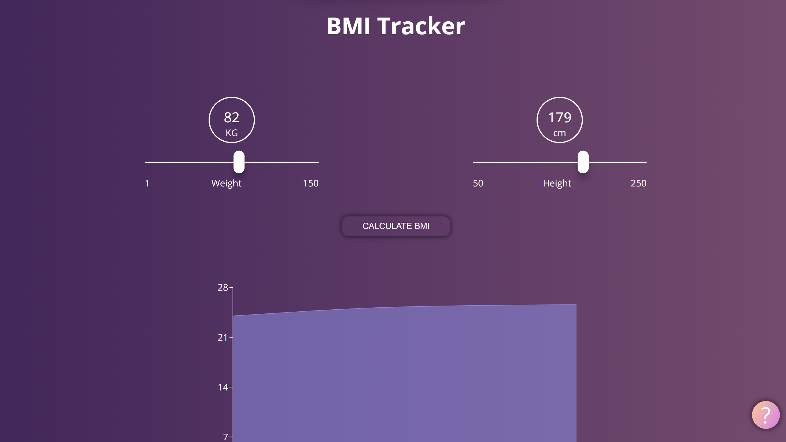
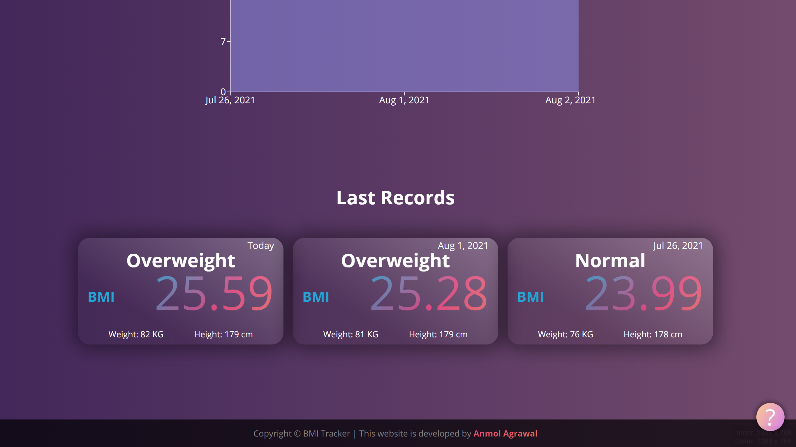
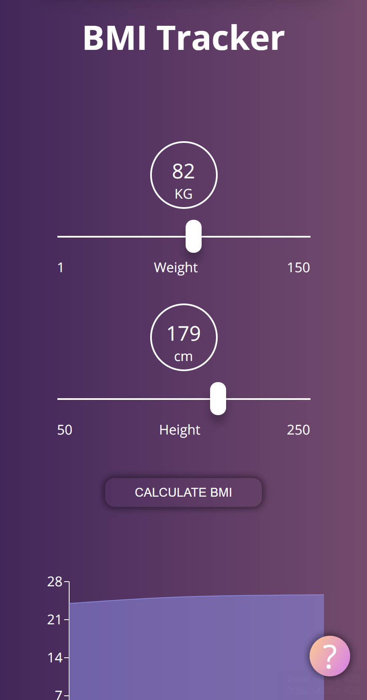
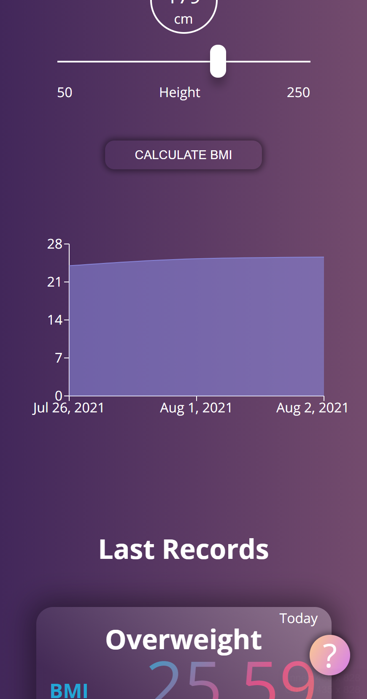
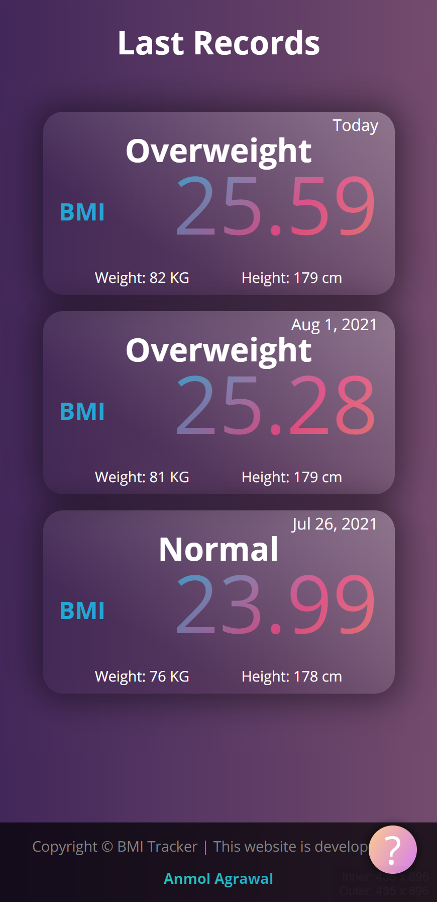

# BMI Tracker

A `Progressive Web Application (PWA)` where users can calculate and keep track of their BMI. Users can store 7 days of records (in _localStorage_).

This app is installable as a native app for Windows, Android, iOS, MacOS, Chrome OS. This web app will also work `offline`.

## Screenshots

### Desktop Site

---

    
    

        Desktop Screenshot 1
    

 

    
    

        Desktop Screenshot 2
    

 

### Mobile Site

---

    
    

        Mobile Screenshot 1
    

 

    
    

        Mobile Screenshot 2
    

 

    
    

        Mobile Screenshot 3
    

 

## Available Scripts

In the project directory, you can run:

### `yarn start`

Runs the app in the development mode.\
Open [http://localhost:3000](http://localhost:3000) to view it in the browser.

The page will reload if you make edits.\
You will also see any lint errors in the console.

## Author
***Anmol Agrawal***

[Mail ID](mailto:anmol.ag53@gmail.com?subject=[GitHub]) | [LinkedIn](https://www.linkedin.com/in/anmol-53/) | [GitHub](https://github.com/Anmol53/) | [LeetCode](https://leetcode.com/anmol_53/) | [CodeChef](https://www.codechef.com/users/uniquecoder_) | [HackerRank](https://www.hackerrank.com/anmol_53)

**"Any suggestions would be appreciated"**
